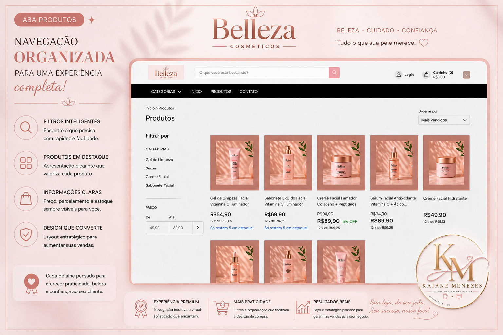
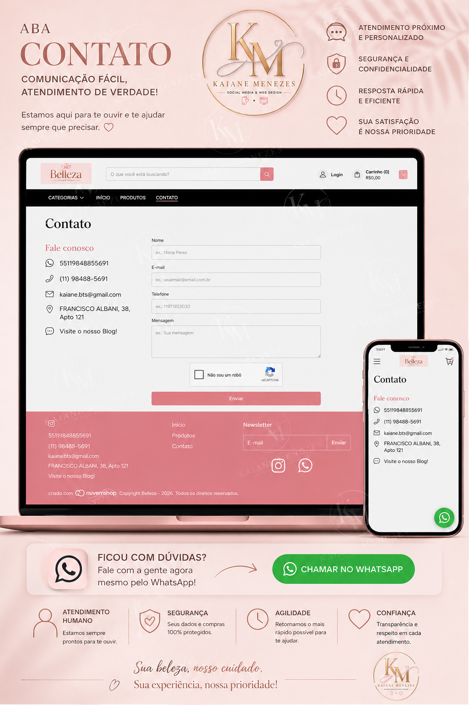

# Site-Belleza
Loja de Cosmetico
# 🛍️ Belleza Cosméticos

Projeto modelo de loja virtual desenvolvido na Nuvemshop.

## Tecnologias utilizadas

- HTML5
- CSS3
- JavaScript
- Nuvemshop

## Minha atuação

- Desenvolvimento da identidade visual
- Personalização da interface
- Estruturação do layout responsivo
- Organização visual dos produtos
- Configuração da experiência mobile

## 🔗 Acesse a loja
(https://kaianemenezes.lojavirtualnuvem.com.br/?exit_preview_theme_installation)

## ✨ Sobre o projeto
Loja criada para estudo e portfólio, com foco em:
- Identidade visual elegante
- Organização de produtos
- Experiência do usuário
- Layout responsivo

## 🏠 Página Inicial

## 🛍️ Produtos

## 📞 Contato

## 🚀 Plataforma
Nuvemshop
